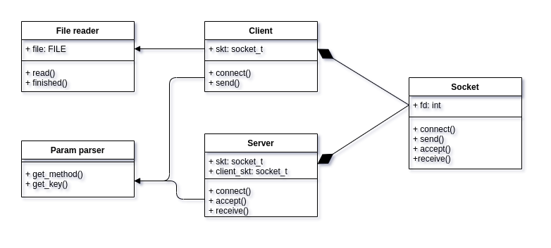
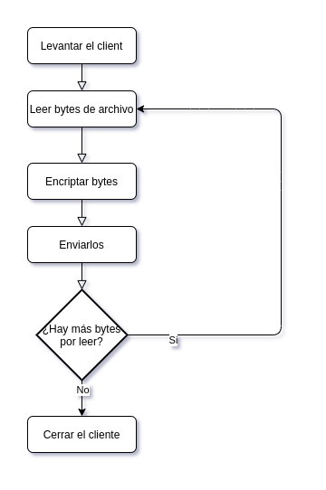
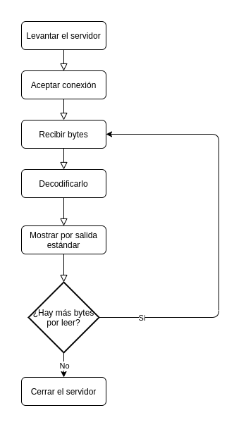

### Nombre : López Núñez, Agustín 
### Padrón: 101826 
### Repositorio : https://github.com/agustinlopezn/tp1-taller-de-programacion

<h1>

Taller de Programacion I [75.42] - TP1: Crypto-Sockets

</h1>

# Introduccion
Se planteó el desarrollo de un programa servidor/cliente, donde se envía un mensaje de manera cliente -> servidor y éste esta cifrado por uno de los tres métodos planteados (Caesar, Vigenere y RC4). Durante todo el proceso se intentó darle importancia a principios de la programación orientada a objetos. Todo se desarrolló en el leguaje C.

# Diseño
El diseño a grandes rasgos se divide en dos grandes partes, por un lado la parte cliente/servidor, en la cual ambos comparten comportamiendo delegado en el socket, y por otra parte el *cipher* que es independiente a los componentes mencionados. 
Luego para cuestiones de parseo de parámetros y cuestiones algo secundarias se agregaron los modulos de *File reader* (el cual solo usa el cliente para obtener pedazos de 64 bytes que luego enviará), *Param parser* que utilizan ambos y el *connection util* que también comparten.  

## Socket
El socket posee en su estructura unicamente su *file descriptor*. Este programa es en gran parte el responsable de la comunicación entre el servidor y el cliente, teniendo gran parte del comportamiento de éstos.
Al ver que tanto servidor como cliente compartían mucho comportamiento, se vió oportuno crear el TDA socket que ambos poseen (en el caso del servidor también posee el del cliente una vez aceptado) ahorrando repetición de codigo y ayudando al encapsulamiento.
## Cliente
El cliente posee un socket, el puerto al cual desea conectarse y enviar mensajes; y la dirección IP. 
Está totalmente aislado de la implementación del servidor o de cualquier *parser/cipher* ya que para la comunicación unicamente recibe una tira de bytes y los envía a traves del socket. 
Su *main* usa al *cipher* y al *file_reader*, ya que no debería ser responsabilidad del cliente tener comportamiento sobre como cifrar o como leer los archivos. Además hace uso del *parser* de parámetros para modularizar y encapsular aún mas la lógica. 
El flujo consiste en obtener el método y la *key* que fueron pasadas por parámetro en la llamada al programa, se crea el cliente (inicializándolo con la dirección y puerto), se lo conecta y se comienza a leer el archivo (para el caso *stdin*) mediante el *file_reader*, éste nos devuelve el buffer pasado por parámetro con la cadena cargada, le dice al *cipher* que encripte el mensaje y lo envía. Una vez que se terminó el archivo se cierra y se destruye el cliente, cortando las conexiones pertinentes.  

## Servidor 
El servidor posee su socket, el socket del cliente y el puerto receptor. 
Su *main* cuenta con cierta simetría con respecto al *main* del cliente (al igual que en ese caso cuenta con el *parser* de parámetros y el *cipher*) y su flujo es el siguiente:
* Se obtienen el método de desencriptación y su *key*.
* Se inicializan los TDAs auxiliares, se conecta el servidor y se acepta la conexión.
* El servidor recibe las tiras de bytes, las desenripta con el *cipher* y las imprime por salida estándar. 
* Cuando deja de recibir bytes destruye el *cipher*, cierra el servidor y lo destruye.
 

## Cipher
Se trató de encapsular la lógica de elegir que encriptación/desencriptación usar dentro del cliente o el servidor y que con la simple llamada a la función `cipher_encrypt()/cipher_decrypt()` ya el *cipher* sepa que método corresponde. Para esto se inicializa el *cipher* con su método y key dejando esos datos dentro de su estructura interna. 
Un problema encontrado aquí fue la necesidad de mantener índices (RC4 utiliza multiples) que la solución fué tenerlos en la estructura. Otro fue la necesidad de persistir el arreglo de caractéres tambien para RC4, esto se solucionó alocando memoria del *heap* únicamente si el método es el mencionado. Si bien es recomendación de la cátedra intentar usar lo menos posible éste tipo de memoria, la solución estática requeriría entrar a la estructura interna del cipher por fuera de sus funciones.

